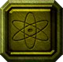

  

<h1 align="center" >
    <!--   -->
 POWER TANKS 
    <!--   -->
</h2>

<video src="https://github.com/user-attachments/assets/ca52e0ec-fe48-41a5-8b55-20235eb58553" width="800" height="600"></video>

My last ever Flash game, developed in 2020, the year when [Flash met it's end](https://www.reddit.com/r/technology/comments/knsskh/flash_dies_today_december_31st_2020_is_officially/). One day I'll port it to a modern framework, but in the meantime, I'd prefer it to be posted here as is, rather than becoming yet another piece of [lost media](https://en.wikipedia.org/wiki/Lost_media).

<h2> 
     
    Keyboard Shortcuts 
     
</h2>

| **Shortcut**      | **Action**                                 |
|-------------------|--------------------------------------------|
| W, S, A, D        | Tank Movement                              |
| Space             | Fire                                       |
| Left/Right Arrows | Rotate Turret                              |
| R                 | Switch Ammo                                |
| Shift             | Fire/Activate Pizza round (when collected) |
| Ctrl              | Deploy shield (when collected)             |
| Escape            | Toggle pause                               |
|                   |                                            |

<h2> 
     
    Features
     
</h2>

- **Box2D engine**: powers all the flawless physics.
- **Particle systems**: shrapnels, smoke, explosions, and other effects, aren't animations, but particle systems. Each one is different.
- **A\* pathfinding**: for those more advanced enemies that will chase you.
- **Level editor**: all levels are created using a built-in level editor, and saved as plain text files.

<h2> 
     
    Installation
     
</h2>

### Windows
1. Download [PowerTanks.swf](https://github.com/mm40/power-tanks/raw/refs/heads/main/PowerTanks.swf) from this repo.
2. Download the [FlashPlayer.exe](https://ia600708.us.archive.org/14/items/flashplayer-11_202503/flashplayer%2011.exe) from [archive.org/flashplayer](https://archive.org/details/flashplayer-11_202503).
3. Drag and drop the `.swf` file in `FlashPlayer.exe`
### Linux
Flash Player for Linux doesn't work too well, so using a Windows virtual machine for Windows steps is recommended. Readily available 12GiB `VHDX` and `QCOW2` images of Windows preinstalled are available [here](https://cloudbase.it/windows-cloud-images/#download). When starting the VM for the first time, the screen might go black for a while, just wait it out. As soon as the desktop is show, follow the Windows instructions above.

<h2> 
     
    Screenshots
     
</h2>

